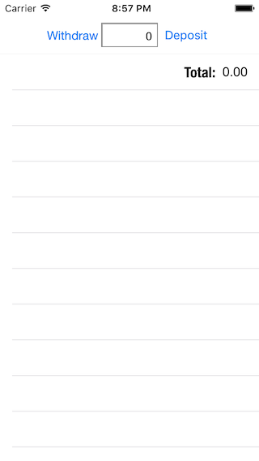
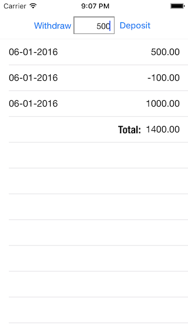

#Bank Account

###Objective
Create a simple bank application with the following features:

Deposit into Account
Withdraw from an Account
Show the current bank statements.

Acceptance criteria Statement should have the following format:

DATE       | AMOUNT  | BALANCE
10/04/2014 | 500.00  | 1400.00
02/04/2014 | -100.00 | 900.00
01/04/2014 | 1000.00 | 1000.00

To Adapt the kata to iOS, I print in each row the transaction and then I have a row that deals with the balance.

###How it Works
Clone the repository:`` https://github.com/ananogal/BankAccount.git`` 
Change to the directory:``$ cd BankAccount ``
Open the .xcworkspace in Xcode

####Run Tests
To run the tests hit ⌘+U

####Run Application
To run the app hit ⌘+R